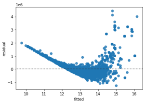

# Car Selling Price Predictor: Project Overview
* Created a regression model that predicts a car's selling price (average r-squared = 0.91, average rmse = 234541 rupees) so individuals interested in selling their car have an easier time deciding a selling price for their car.
* The dataset used to train the model was from [Kaggle](https://www.kaggle.com/nehalbirla/vehicle-dataset-from-cardekho?select=Car+details+v3.csv). The dataset consists of information about used cars from CarDekho (a website where users can sell or purchase cars in India).
* 8128 cars in dataset (before cleaning)
* Performed necessary cleaning steps on data such as, removing missing values and removing unrealistic values (selling_price, mileage, etc.)
* Formatted categorical features into useable features (Units for mileage, engine, and max_power were removed and then converted to numerical data. The name of each car was converted to the country it orginated from.) for multiple linear regression model and decision tree model
* Exploratory data analysis consisted of checking for strong linear association between features and the response through correlation heatmap and scatterplots.
* Model assumptions for multiple linear regression were checked and cross validation was performed for the decision tree model to assess generalization.

## Code
**Python Version**: 3.8.8 
**Packages**: numpy, pandas, matplotlib, seaborn, sklearn, statsmodels, scipy 
**Requirements**: `pip install -r requirements.txt`

## Data
Dataset from [Kaggle](https://www.kaggle.com/nehalbirla/vehicle-dataset-from-cardekho?select=Car+details+v3.csv) consists of information about used cars (8128 cars) from CarDekho (a website where users can sell or purchase cars in India).
* **name** - name of the car
* **year** - year the car was purchased
* **selling_price** - the car's selling price
* **km_driven** - number kilometers the car has driven
* **fuel** - fuel type (Diesel, Petrol, CNG, LPG)
* **seller_type** - whether the car was sold by an individual or dealer                
* **transmission** - the car's gear transmission (Automatic/Manual)
* **owner** - number of previous owners
* **mileage** - mileage of the car
* **engine** - car's engine capacity
* **max_power** - max power of engine (bhp)
* **torque** - car's torque
* **seats** - number of seats in the car

## Data Cleaning/Formatting Variables
The dataset required cleaning before it could be used in regression models. The following changes to the dataset were made:
* Rows with missing values were dropped (222 rows)
* name was formatted to origin (country car originated from, Asia/Europe/North America)
* fuel was formatted to a variable with two categories (Petrol/Diesel)
* mileage was converted to numeric variable (kmpl was removed from string and then converted to float)
* engine was converted to numeric variable (CC was removed from string and then converted to integer)
* max_power was converted to numeric variable (bhp was removed from string and then converted to float)
* torque column was removed (was difficult to clean)
* cars with greater than 804672 km (500000 miles) driven were removed (suspiciously high)
* car with unreasonably high mileage was removed
* name and owner columns were removed (were not used in models)

## EDA
I investigated the linear relationships of the features with the response variable (selling_price) to see if any features would potentially contribute significantly in a MLR model. Below are some visualizations I used to explore linear relationships.

     

## Model Development
For the first model I trained a **MLR** and split the data into train and test sets with a test size of 25%.

It was necessary to check all assumptions before considering the MLR model for deployment. The MLR model rejected both homoscedasticity and normality of errors with and without log/square root transformations of features and log transformation of the response. Below are the plots used to confirm homoscedasticity and normality of errors after log transfomring the response.

 

Due to essential assumptions for MLR being rejected I decided to train a non parametric model such as the **decision tree**.

Before fitting the decision tree model categorical variables were encoded into dummy variables. Ten fold cross validation was performed to assess the model's ability to generalize and max_depth was set to 5 to prevent overfitting.

## Model Performance
Since the MLR model's assumptions were rejected its goodness of fit measures were unreliable.

The decision tree model with ten fold cross validation outputted the following results (values are averages of ten folds):
* **train set r-squared** = 0.94
* **test set r-squared** = 0.91
* **train set rmse** = 198760.16
* **test set rmse** = 234266.62

 

## Conclusion
Based on the results for the MLR model and the decision tree model, the decision tree is the better model to use to accurately predict a car's selling price. The next steps would be to deploy the decision tree model through a web app using flask.

## Resources
**Code Related**:
* [https://pandas.pydata.org/pandas-docs/stable/reference/index.html](https://pandas.pydata.org/pandas-docs/stable/reference/index.html)
* [https://matplotlib.org/stable/api/index.html](https://matplotlib.org/stable/api/index.html)
* [https://seaborn.pydata.org/api.html](https://seaborn.pydata.org/api.html)
* [https://scikit-learn.org/stable/modules/classes.html](https://scikit-learn.org/stable/modules/classes.html)
* [https://www.kite.com/python/answers/how-to-replace-elements-in-a-numpy-array-if-a-condition-is-met-in-python](https://www.kite.com/python/answers/how-to-replace-elements-in-a-numpy-array-if-a-condition-is-met-in-python)
* [https://stackoverflow.com/questions/50733014/linear-regression-with-dummy-categorical-variables](https://stackoverflow.com/questions/50733014/linear-regression-with-dummy-categorical-variables)
* [https://www.youtube.com/watch?v=Pbadcqnyzi0](https://www.youtube.com/watch?v=Pbadcqnyzi0)
* [https://stackoverflow.com/questions/35876508/evaluate-multiple-scores-on-sklearn-cross-val-score](https://stackoverflow.com/questions/35876508/evaluate-multiple-scores-on-sklearn-cross-val-score)
* [https://www.geeksforgeeks.org/plotting-multiple-bar-charts-using-matplotlib-in-python/](https://www.geeksforgeeks.org/plotting-multiple-bar-charts-using-matplotlib-in-python/)
* [https://www.youtube.com/watch?v=yJcYu_fqXdQ](https://www.youtube.com/watch?v=yJcYu_fqXdQ)
* [https://www.markdownguide.org/cheat-sheet/](https://www.markdownguide.org/cheat-sheet/) 

**Research**:
* [https://www.xe.com/currencyconverter/convert/?Amount=1&From=INR&To=USD](https://www.xe.com/currencyconverter/convert/?Amount=1&From=INR&To=USD)
* [https://www.autoblog.com/2009/10/03/million-mile-cars/](https://www.autoblog.com/2009/10/03/million-mile-cars/)
* [https://www.nytimes.com/2007/06/03/automobiles/03MILES.html](https://www.nytimes.com/2007/06/03/automobiles/03MILES.html)
* [https://www.mpgtolitres.com/kml-to-mpg](https://www.mpgtolitres.com/kml-to-mpg)
* [https://www.unitconverters.net/length/km-to-miles.htm](https://www.unitconverters.net/length/km-to-miles.htm)
* [https://www.evanshalshaw.com/blog/top-10-most-economical-used-petrol-cars/](https://www.evanshalshaw.com/blog/top-10-most-economical-used-petrol-cars/)
* [https://www.evanshalshaw.com/blog/top-10-most-economical-diesel-cars/](https://www.evanshalshaw.com/blog/top-10-most-economical-diesel-cars/)
* [https://www.encycarpedia.com/top/least-powerful-cars](https://www.encycarpedia.com/top/least-powerful-cars)
* [https://www.autosnout.com/Car-Power-List.php](https://www.autosnout.com/Car-Power-List.php)
* [https://www.financialexpress.com/auto/gallery/prices-of-popular-cars-in-india-vs-us-why-and-how-much-are-we-overpaying/photos/767007/](https://www.financialexpress.com/auto/gallery/prices-of-popular-cars-in-india-vs-us-why-and-how-much-are-we-overpaying/photos/767007/)
* [https://auto.hindustantimes.com/auto/cars/maruti-celerio-most-fuel-efficient-petrol-car-may-offer-26-kmpl-mileage-41636081009925.html](https://auto.hindustantimes.com/auto/cars/maruti-celerio-most-fuel-efficient-petrol-car-may-offer-26-kmpl-mileage-41636081009925.html)
* [https://www.autocarindia.com/car-news/top-10-fuel-efficient-diesel-cars-in-india-395465](https://www.autocarindia.com/car-news/top-10-fuel-efficient-diesel-cars-in-india-395465)
* [https://www.holmesvolvocars.com/volvo-xc90-hybrid-mpg.htm](https://www.holmesvolvocars.com/volvo-xc90-hybrid-mpg.htm)

**Formatting Github Repo**
* [https://www.youtube.com/watch?v=agHKuUoMwvY](https://www.youtube.com/watch?v=agHKuUoMwvY)

